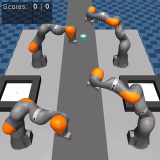

# ADLR Challenge Summer Term 2024

This repository contains the code of Team 7 participating in the ADLR Factory Manipulation Challenge in the summer term 2024.

The challenge considers behaviours for a robot manipulator to pick objects from a conveyor belt and place them into a basket. 

The objective is to maximise the number of objects collected during an episode.
An episode terminates once any object leaves the workspace or any arm collides with something.




## Installation

1. Fork this repository and clone it to your machine.
2. Create a new virtual environment, activate it and install the dependencies using `pip`. 
For example:
```bash
   conda create -n "adlr" python==3.10
   conda activate adlr
   pip install -e ./challenge_env
```

## Getting started

The folder `src` contains all challenge-specific code.
- `environments.py` contains class definitions for custom environments
- `learning.py` is the training script
- `visualisation.py` is a script for running simulations

To execute a simulation visually, run:
```bash
python src/visualisation.py
```
If there is no visual output, make sure `RENDER_MODE` is set to `"human"` in the script.

## Artifacts

The folders `poster`, `preso`, `report`, and `videos` contain the project poster, milestone presentation, final report,
and demo videos, respectively.


## Headless rendering

For headless rendering (e.g. on a vm without a display), you need to install the following dependencies:
```bash
sudo apt-get install libgl1-mesa-glx libosmesa6
conda activate adlr
conda install -c conda-forge mesalib
```
and set the environment variable `MUJOCO_GL=osmesa`. In python, you can do this with the following code:
```python
import os
os.environ["MUJOCO_GL"] = "osmesa" # set environment variable for headless rendering

env = TaskEnv(render_mode="rgb_array") # create environment with rgb_array rendering
rgb_array = env.render() # renders the environment
```