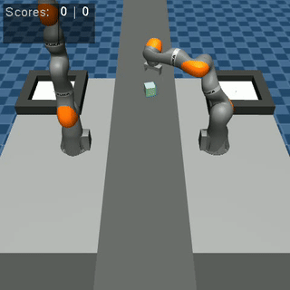

# ADLR Challenge Summer Term 2024

This repository contains the starting point for the ADLR Factory Manipulation Challenge in the summer term 2024.

The challenge is about learning behaviors for a robot manipulator to collect objects from a conveyor belt and put them into a basket. 

The objective is to maximize the number of objects collected during an episode.
The episode terminates when any object leaves the table area.



# Installation

1. Fork this repository and clone it to your machine.
2. Create a new virtual environment, activate it and install the dependencies using pip. 
For example:
```bash
   conda create -n "adlr" python==3.10
   conda activate adlr
   pip install -e ./challenge_env
```

# Get started
The file `learn/task_env.py` contains a template for a training task 
as well as a simple loop to interact with the environment. 

To view the task, run:
```bash
python learn/task_env.py
```

We also provide an example of running a vectorized version of the environment in `learn/vec_env_example.py`.

